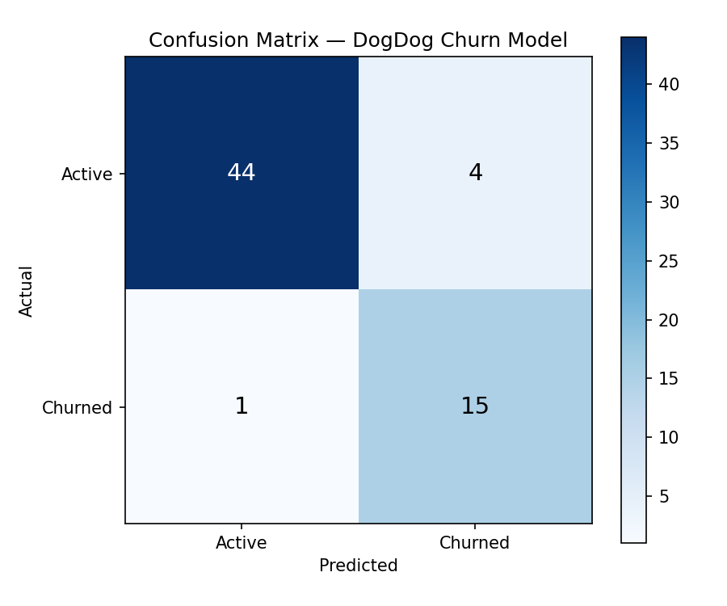

# Simulation ETL & Churn Pipeline


End-to-end data pipeline that extracts sales records from a CSV export (as produced by an AppSheet POS), transforms and loads them into a SQLite warehouse, and trains a logistic regression model to flag dog owners at churn risk — customers with no return visit in the last 60 days of the observation window.

---

## Overview

This is a simulated dataset modelled after a dog daycare operation in Guadalajara, Jalisco. The business runs its point-of-sale on AppSheet, which accumulates transactional records for services like Guardería (day boarding), Baño (grooming), Corte (haircut), Hotel (overnight), and Adiestramiento (training). This project covers the full workflow: raw CSV → cleaned warehouse → customer-level feature store → churn risk score per customer.

The churn model is intentionally simple (logistic regression, five features) to keep the focus on the pipeline rather than the model. Real production iteration would start here.

---

## Stack

| Layer         | Tool                                      |
|---------------|-------------------------------------------|
| Extract       | pandas `read_csv` with schema validation  |
| Transform     | pandas: date parsing, feature engineering |
| Load          | SQLAlchemy 2.0 + SQLite (upsert by PK)   |
| ML            | scikit-learn `LogisticRegression`         |
| Orchestration | Python CLI (`argparse`, `logging`)        |
| Visualization | matplotlib + seaborn (EDA notebook)       |

---

## Pipeline Architecture

```
data/raw/sales_export.csv
         │
         ▼
  ┌─────────────┐
  │  extract.py  │  schema validation, dtype enforcement
  └──────┬──────┘
         │  raw DataFrame
         ▼
  ┌──────────────┐
  │ transform.py  │  date parsing, service normalization,
  └──────┬───────┘  per-customer feature engineering
         │  (sales_df, customer_features_df)
         ▼
  ┌────────┐
  │ load.py │  SQLAlchemy upsert → SQLite
  └────┬───┘
       │
       ├── sales             (10,558 rows, PK: sale_id)
       └── customer_features (320 rows,  PK: customer_id)
                │
                ▼
       models/churn_model.py
                │
                ▼
       data/churn_predictions.csv  (churn_score, churn_prediction per customer)
```

---

## How to Run

```bash
# 1. Create and activate virtual environment
python3 -m venv venv
source venv/bin/activate       # Windows: venv\Scripts\activate

# 2. Install dependencies
pip install -r requirements.txt

# 3. Generate synthetic data
python scripts/generate_synthetic_data.py

# 4. Run the ETL pipeline (dev mode — verbose console logging)
python scripts/run_pipeline.py --env dev

# 5. Train churn model
python models/churn_model.py

# 6. Evaluate model
python models/evaluate.py

# Optional: run pipeline in prod mode (WARNING+ logging to file)
python scripts/run_pipeline.py --env prod
```

---

## Data Dictionary

**`sales`**

| Column           | Type    | Description                                      |
|------------------|---------|--------------------------------------------------|
| `sale_id`        | TEXT PK | Unique transaction ID (format: DD-XXXXXX)        |
| `date`           | TEXT    | Transaction date (ISO 8601: YYYY-MM-DD)          |
| `customer_id`    | TEXT    | Customer reference (format: C-XXX)               |
| `dog_name`       | TEXT    | Dog's name                                       |
| `service`        | TEXT    | Service type (Guardería/Baño/Corte/Hotel/Adiestramiento) |
| `price_mxn`      | REAL    | Transaction amount in Mexican pesos              |
| `payment_method` | TEXT    | Efectivo / Tarjeta / Transferencia               |
| `employee_id`    | TEXT    | Staff member (EMP-01 through EMP-08)             |
| `notes`          | TEXT    | Short operational note (~60% populated)          |
| `is_churned`     | INTEGER | 1 if customer had no visit after 2024-06-01      |

**`customer_features`**

| Column                  | Type    | Description                                  |
|-------------------------|---------|----------------------------------------------|
| `customer_id`           | TEXT PK | Customer reference                           |
| `days_since_last_visit` | INTEGER | Days from last visit to 2024-06-30           |
| `visit_frequency`       | REAL    | Average visits per month                     |
| `avg_spend`             | REAL    | Mean transaction value (MXN)                 |
| `preferred_service`     | TEXT    | Most common service for this customer        |
| `total_revenue`         | REAL    | Lifetime revenue from this customer          |
| `is_churned`            | INTEGER | Churn label — sourced from raw data          |

---

## Model Performance

Logistic Regression on 20% held-out test set (64 customers, stratified).  
Threshold set to **0.35** (below the default 0.5) to favour recall on the 25%-minority churn class.

| Metric    | Score  |
|-----------|--------|
| Accuracy  | 0.9219 |
| Precision | 0.7895 |
| Recall    | 0.9375 |
| F1        | 0.8571 |
| ROC-AUC   | 0.9635 |

Full test set: 48 active customers, 16 churned. The model missed 1 churned customer (false negative) and flagged 4 active customers as at-risk (false positives). At 0.35 threshold, recall is the priority — the cost of missing a churned customer outweighs the cost of a low-value re-engagement campaign.



---

## Notes

- Data in this repo is fully synthetic, generated to reflect realistic operational patterns of a dog daycare business. No real customer data is included.
- Churn is defined as no visit on or after **2024-06-01** (the 60-day cutoff before the dataset end of 2024-06-30). This definition lives exclusively in `scripts/generate_synthetic_data.py`; `transform.py` and `churn_model.py` import the constant rather than redefining it.
- The `--env prod` flag redirects logging to `data/simulation_pipeline_prod.log` at WARNING+ level. All validations still run in both environments.
